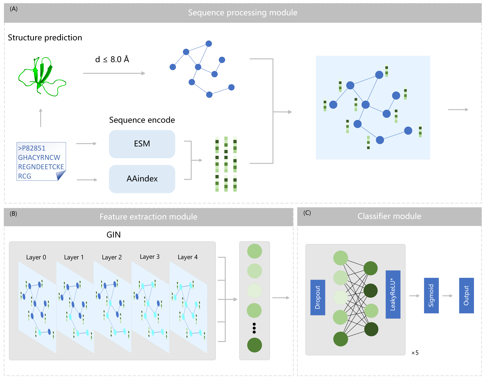

# ToxGIN

## based on GIN to predict peptide toxicity

ToxGIN represented the 3D structures of peptides predicted by ColabFold as graphs, with amino acid residues and their interactions serving as nodes and edges, respectively. Next, to leverage the capabilities of the ESM2 protein language model , ToxGIN extracted deep biological features from peptide sequences and further enriched the feature representation of each amino acid node with physicochemical properties. Subsequently, GIN aggregated information from neighboring nodes to extract local and global features, followed by nonlinear transformation to output toxicity prediction probabilities.

The source code for our paper [ToxGIN: an In silico prediction model for peptide toxicity via graph isomorphism networks integrating peptide sequence and structure information](https://academic.oup.com/bib/article/25/6/bbae583/7891575?searchresult=1)

## How to Train

Use `preprocess.py` for preprocessing the sequence and structure data, and use `train.py` for model training.

## How to Infer

Taking the test dataset as an example, write the sequences to be predicted in the `test_sequence.csv` file, and place the structure files in the `test_structures` folder. The structure files should be named as "sequence" + ".pdb". First, use `predict_preprocess.ipynb` to preprocess the sequence and structure files, and then use `predict.ipynb` for prediction.
